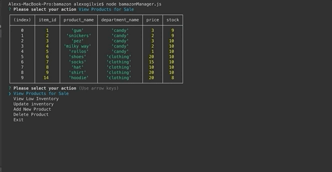
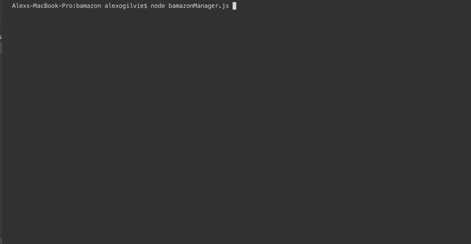

<h1>Bamazon Database</h1>

<h2>How it works</h2>

Bamazon is a CLI inventory database app. There are two seperate apps within Bamazon. by typing node bamazonCustomer into your terminal you are able to interact as if you were a customer. A list of products and their prices will be displayed. You will be prompted to choose an action as demonstrated below. If you enter node bamazonManger.js into the terminal you will have increased ability to interact with the database.

<h2>Technologies Used</h2>
<ul>
    <li>Node</li>
    <li>mySQL</li>
    <li>Inquirer</li>
    <li>JavaScript</li>
</ul>

<h2>Customer Actions</h2>
<ul>
<li>View products</li>
<li>Make purchase</li>
</ul>

<h2>Manager Actions</h2>
<ul>
<li>View All Inventory</li>
<li>View Low Inventory</li>
<li>Update Inventory</li>
<li>Add new product</li>
<li>Delete Product</li>
<li>Exit Program</li>
</ul>

<h2>Demonstration</h2>
<h3>Customer</h3>

<li>Buy Item</li>
 

<h3>Manager </h3>
<li>Add New</li>
 

<li>Delete Item</li>
 

<li>Update Inventory</li>
 

<li>View Low Inventory</li>
 

 

<li>View Products</li>

